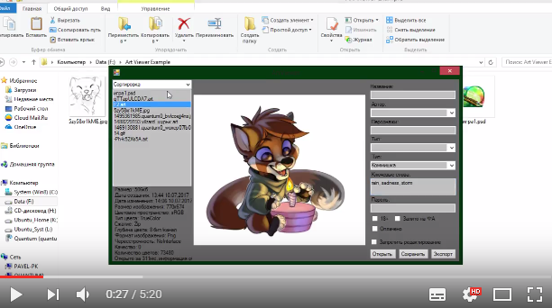

# ArtViewer

Данный репозиторий включает в себя три проекта:
* ArtViewer - Просмотрщик изображений
*
* GUI Integration - COM-сборка для интеграции в explorer.exe
*
* ArtLib - Библиотека содержащая класс собственного формата файлов
Просмотрщик изображений с возможностью проссмотра gif-анимаций и psd-файлов, собственным форматом, позволяющим установить на файл пароль или заблокировать для изменений + интеграция в GUI

## ArtViewer

Данный просмотрщик изображений позволяем просматривать популярные графические форматы, в том числе он может отображать PSD файлы и воспроизводить GIF анимации. В дальнейшем планировалось добавить возможность просмотра слоёв PSD, кадров GIF и просмотр 3д объектов формата OBJ.

## GUI Integration

Данная COM сборка интегрируется в explorer.exe, предоставляя возможность:
* Просмотреть миниатюры ART файлов (генерирует Thumbnail)
*
* Преобразовать файл изображений в файл формата ART
*
* Производить манипуляции над файлами формата ART, а именно: добавить/удалить пароль, экспортировать содержимое и т.д.
*
* Просматривать метаданные ART файла в виде всплывающей подсказки

## ArtLib

Библиотека позволяет двум проектам, описанным выше, взаимодействовать с форматом .ART

## Формат .ART

Данный формат представляет собой "обёртку" для графических форматов, хранящий кроме самого изображения следующие данные:

* Название
*
* Автор
*
* Изображённые на данном арте персонажи
*
* Тип арта (по качеству прорисованности)
*
* Тип арта (Gift/Request/Commission/YCH/etc)
*
* Ключевые слова
*
* Флаги: залит ли арт на ФА, пометка 18+ и пометка об оплате

Кроме того данный формат позволяет установить пароль на изображение. Без пароля недоступно редактирование данных об арте и полноценный просмотр. Без пароля изображение отображается в уменьшенном качестве и чёрно-белым.

# Видео демонстрация проекта

